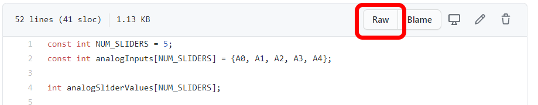
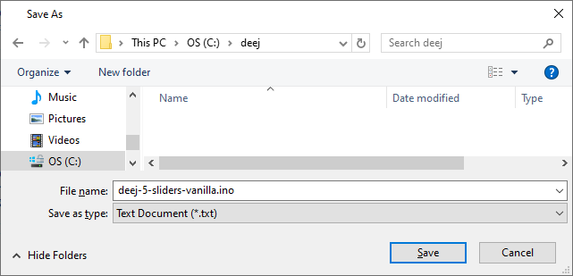
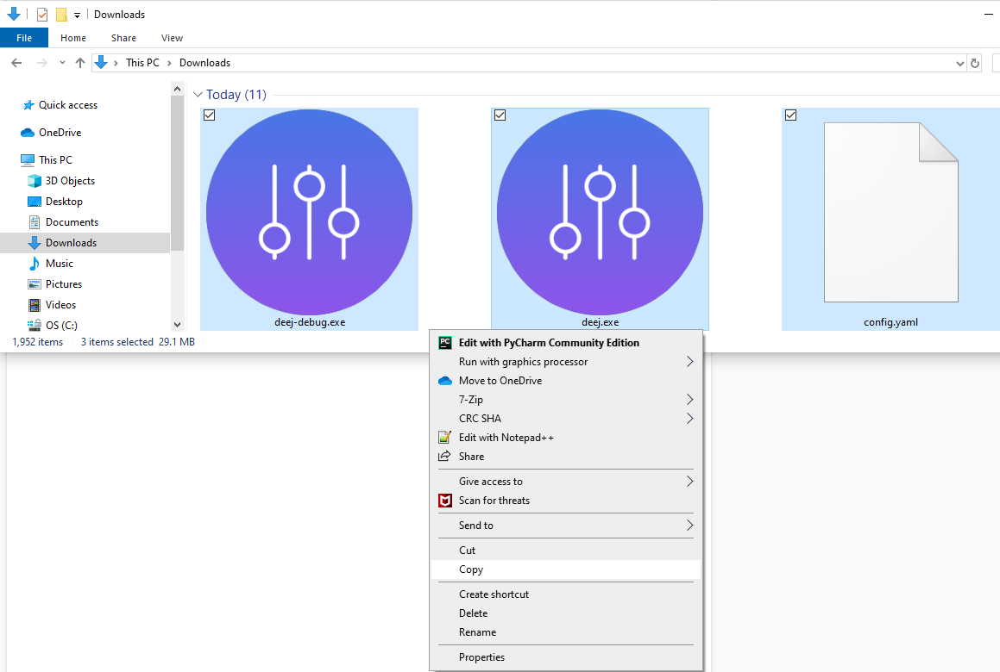
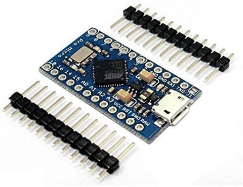
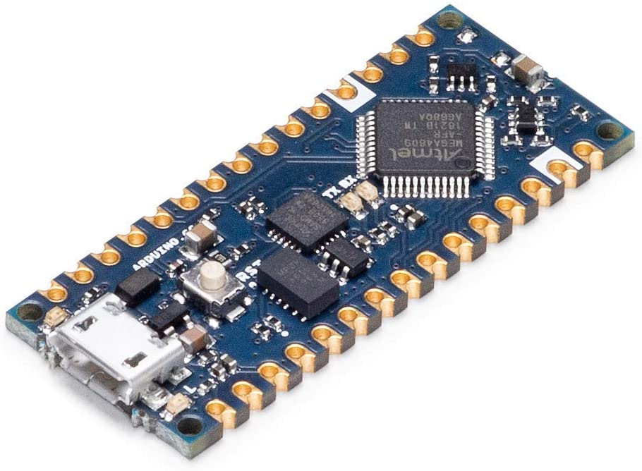

# Gather your stuff
 <details>
  <summary>Click to expand</summary> 

 ## Software
 <details>
  <summary>Click to expand</summary> 

 * For your Arduino
   <details>
   <summary>Click to expand</summary> 

   1. Point your browser to: https://github.com/omriharel/deej/blob/master/arduino/deej-5-sliders-vanilla/deej-5-sliders-vanilla.ino
   1. Click on the **Raw** button
   
   1. Right click anywhere on the new page, and select **Save as**
   
   1. Make a folder named **deej** in your C:\ drive and save **deej-5-sliders-vanilla.ino** to it
   
   1. Point your browser to: https://www.arduino.cc/en/Main/Software 
   1. Click on **Windows Installer** to download the latest version
   

   </details>

  * For your PC

    <details>
    <summary>Click to expand</summary> 

    1. Point your browser to: https://github.com/omriharel/deej/releases/tag/v0.9.10
    1. Scroll to the **Assets** section at the bottom 
    
    1. Click on **config.yaml**, this should save a copy to your **Downloads** directory
    1. Click on **deej-debug.exe**, this should save a copy to your **Downloads** directory
    1. Click on **deej.exe**, this should save a copy to your **Downloads** directory
    1. Go to your **Downloads** directory, select the 3 files from above, right click, Copy
    
    1. Go to your **C:\deej** directory, right click, paste
    
    </details>

 </details>

 ## Hardware
 <details>
  <summary>Click to expand</summary> 

  * Arduino - pick one and get it
    <details>
    <summary>Click to expand</summary> 

     Model | Pro | Con | Example
     :------------: | :-------------: | :-------------: | :-------------:
     **Pro Micro** | * Keyboard/mouse emulation via HID | * Cramped |  https://www.amazon.com/dp/B012FOV17O
     **Nano** | * Cheaper | * Longer, No HID |  https://www.amazon.com/dp/B07VX7MX27
    </details>

  * Potentiators ("Pots")
    <details>
    <summary>Click to expand</summary> 

    https://www.amazon.com/dp/B01CZVZ16O 
    </details>  

 </details>
</details>

# Test your Stuff

<details>
 <summary>Click to expand</summary> 
 
 ## Test your Arduino
 <details>
 <summary>Click to expand</summary> 
 
1. Go to [The Arduino Download Page](https://www.arduino.cc/en/software) to download the latest IDE for your OS
1. Click on **Windows Installer** to download the latest version

1. Install and launch the IDE
1. Select **_File->New_** and delete everything in the new window that opens up
1. Select **_Tools->Board_** and choose your Arduino model.  _for Pro Micros, choose Arduino Leonardo_ 

1. Select **_Tools->Ports_** and choose the same serial port that you jotted down earlier 

1. In the editor window paste in this code borrowed from **Abdullah Al Mamun** from [Instructables.com](https://www.instructables.com/Arduino-Function-Serialread-And-SerialreadString/) 
 ```c
 String a;
 void setup() {
  Serial.begin(9600); // opens serial port, sets data rate to 9600 bps
 }

 void loop() {
  while(Serial.available()) {
   a= Serial.readString();// read the incoming data as string
   Serial.println(a);
  }
 }
```

1. Select **_Sketch->Verify/Compile_**.  You can click **_Save_** when it prompts you to save the sketch folder.  

1. You should see a green **Done Compiling** status at the bottom of your Arduino window 

1. Select **_Sketch->Upload_**.

1. You should see the status change to **Uploading**, the lights on the Arduino should blink, followed by a green **Done Uploading** status at the bottom of your Arduino window. 

1. If you get an error while uploading, some Arduino models require you to select your Bootloader.  To do that, select **_Tools->Processor->(Old Bootloader)_** and try uploading again.  

1. Select **_Tools->Serial Monitor_** 

1. Make sure the 2 selections on the lower right hand of the screen are: **Both NL & CR** and **9600 baud** 

1. In the text box, type in **_Hello World_** and click **_Send_**
1. If all goes well, you should see the same words show up below the text box next to a timestamp 

1. **Congratulations**
 <details>
  <summary>
   
   _Curious as to what the program did?_
   </summary>
  
  It created a variable (**a**) to be a placeholder.  It then set speed at which the Arduino communicates with the computer over the Serial port (interesting tidbit, USB stands for _Universal **Serial** Bus_) to 9600 bauds.  Remember that is also the speed that we are using to monitor the iteractions.  
  
  After that, it runs an infinite loop that checks the Serial port for data.  If there's no data, it does nothing.  But since it's an infinite loop, it will immediately check the Serial port for data again.  This happens over and over again until finally you type in "Hello World" and hit Send.  That sends the data from your computer over the Serial port to the Arduino.  The check detects data when this happens.  It will then use the variable (**a**) to temporarily hold on to that data.  Lastly, it will dump that data back onto the Serial port for the computer to display.
  
  This is why everything you type in the text box will show up in the output window after a small delay.
 </details>
 </details>
 
 ## Test your Pots

</details>

# Build your deej prototype
# Final deej build
<details>
 <summary>Click to expand</summary> 
 
 ## Solder and test
 
 
 ## Enclosures
 <details>
 <summary>Click to expand</summary> 
 
 Check out the **[deej showcase](https://github.com/omriharel/deej/blob/master/community.md)** for inspiration 
 </details>
</details>

